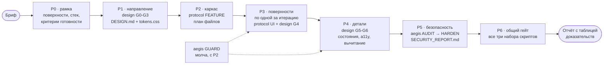

<div align="center">

<h1>Viora Skills</h1>

<p>
  <b>Три скилла, которые превращают кодового ИИ-агента в команду:</b><br/>
  дизайнер · инженер · безопасник<br/>
  <sub>плюс оркестратор, который проводит проект через всех троих по фазам</sub>
</p>

<p>
  
  
  
  
</p>

<p>
  <sub>
    Claude Code · Codex · Antigravity · Cursor · Windsurf · Gemini CLI · Copilot<br/>
    opencode · Cline · Roo · Kilo · Continue · Aider · Zed · любой агент с <code>AGENTS.md</code>
  </sub>
</p>

<p>
  <a href="#skills"><b>Скиллы</b></a> ·
  <a href="#tech"><b>Технически</b></a> ·
  <a href="#install"><b>Установка</b></a> ·
  <a href="#pipeline"><b>Как работают вместе</b></a> ·
  <a href="#limits"><b>Границы</b></a>
</p>

</div>

---

Агент по умолчанию пишет код, который **выглядит** правильно: генерируется второй компонент вместо
использования существующего, интерфейс похож на шаблон, `"готово"` заявляется без единого запуска
тестов, а валидация ввода появляется «потом». Эти три скилла закрывают три разных провала — каждый
своим набором правил, скриптов проверки и обязательным форматом отчёта.

Один стандарт для всех агентов: один и тот же пакет, меняется только способ, которым конкретный
агент его находит. Четвёртый пакет — **viora-build** — не добавляет ни одного своего правила: он
только ведёт проект по фазам и на каждой передаёт работу нужному из трёх.

<br/>

<a name="skills"></a>

## Часть 1 — Скиллы

| | Скилл | Отвечает за | Главный вопрос |
|:--:|---|---|---|
| ◆ | [**viora-design-skills**](#design) | Как это **выглядит** | «Это красиво или просто аккуратно?» |
| ◆ | [**viora-code-protocol**](#protocol) | Как это **сделано** | «Это доказано или ты так думаешь?» |
| ◆ | [**viora-aegis**](#aegis) | Как это **ломают** | «Это уязвимость или просто совпадение регулярки?» |
| ▸ | [**viora-build**](#build) | В каком **порядке** | «Какая сейчас фаза и чем она закрывается?» |

<br/>

<a name="design"></a>

### ◆ viora-design-skills


> **Арт-директор и senior design engineer в одном скилле.** Задача — не «приемлемо», а чтобы
> пользователь вслух сказал: «красиво». Один скилл вместо шести.

Включается на любой работе с интерфейсом: лендинг, дашборд, экран приложения, компонент, форма,
пустое состояние, токены, типографика, цвет, движение, доступность, тёмная тема — и на просьбах
вроде «сделай красиво», «выглядит как шаблон», «убери ощущение ИИ».

**Что он делает вместо вас**

- Заставляет **выбрать направление** до первой строки кода — неопределившийся дизайн выглядит
  сгенерированным, каким бы чистым он ни был.
- Держит **контракт токенов**: один акцент, одно семейство радиусов, одна пара шрифтов, один ритм
  отступов. Внутри компонентов — ни одного сырого hex, ни одного магического px.
- **Вычитает** всё, что не заслужило место, и добивает детали, которые никто не называет, но все
  чувствуют: цвет выделения, каретка, фокус-ринг, скроллбар, табличные цифры, оптическое
  выравнивание.
- Ловит «машинный» интерфейс механически: фиолетово-голубой AI-градиент, mesh-блобы в герое, три
  одинаковые карточки в ряд, всё по центру, кликабельный `div`, дефолтная тень из доки фреймворка,
  `transition: all`, `100vh`, `Lorem ipsum`.
- Оставляет в проекте **`DESIGN.md`** — контракт дизайна. Следующая сессия не выдумывает стиль
  заново, а читает его.

<br/>

<a name="protocol"></a>

### ◆ viora-code-protocol


> **Инженерный стандарт для любой задачи с кодом.** Закон: отгружай самое маленькое, самое ясное
> изменение с одним владельцем — и **докажи** свежим выводом команд, что оно работает.

Включается всегда: фича, багфикс, рефакторинг, ревью чужого диффа, UI, оптимизация. Любой язык,
любой фреймворк. Правила репозитория всегда выше протокола — и об этом говорится в отчёте.

**Шесть дефектов, ради которых он существует**

| Дефект | Как выглядит | Что его останавливает |
|---|---|---|
| **Дублирование** | второй `Modal`, второй `formatDate`, два файла на одну работу | разведка: найди владельца концепта до того, как писать |
| **Наложение** | два интерфейса смонтированы разом, war of z-index | одна точка монтирования, «замени, а не накладывай» |
| **Сироты и мёртвый код** | файл, который никто не импортирует; старое «на всякий случай» | всё новое подключается сразу, заменённое удаляется в том же изменении |
| **Раздутость** | файл на 900 строк, функция на 120, вложенность 5 | числовые лимиты + «никаких абстракций до второго потребителя» |
| **Тяжесть** | ре-рендер на каждый символ, слушатели без снятия, N+1 | бюджеты производительности + парный teardown |
| **Фальшивая готовность** | «готово, должно работать» без вывода команд | железный закон: нет свежего доказательства — нет заявления |

Отдельно важное: протокол работает **и на слабых моделях**. Полоса `LITE` — буквальный чек-лист из
12 шагов и маленькие диффы. Полоса `FULL` — письменный контракт, карта владельцев и ревью по шести
линзам. Ворота у обеих полос одинаковые.

<br/>

<a name="aegis"></a>

### ◆ viora-aegis


> **Защитный security-инженер, а не обёртка над сканером.** Совпадение регулярки — это *зацепка*,
> а не находка. Пока путь «недоверенный вход → достижимый sink → реальное последствие» не
> прослежен, находки нет.

Включается, когда код трогает недоверенный ввод, авторизацию, сессии, платежи, загрузки файлов или
персональные данные; перед коммитом, PR и релизом; при разборе подозрения на уязвимость; при
ревью зависимостей, Dockerfile, CI и IaC; и на любой работе с LLM-фичами, инструментами, RAG и
памятью агента.

**Что он делает вместо вас**

- Строит модель угроз по STRIDE и пишет abuse case рядом с каждым use case — эта фраза становится
  первым тестом.
- Держит **десять законов**: недоверенный ввод по умолчанию (включая вывод LLM), никаких команд из
  строк, authN ≠ authZ, отказ по умолчанию при сбое, ноль секретов в репозитории, кодирование на
  месте вывода, крипта — вызов библиотеки, минимум привилегий, всё ограничено лимитами, логи без
  утечек.
- Чинит **класс проблемы**, а не строку, и к каждой находке даёт патч под этот стек — не ссылку на
  статью о best practices.
- Закрывает то, чего нет в обычных чек-листах: prompt injection, небезопасный вызов инструментов,
  обработка вывода модели, отравление памяти и RAG, бюджеты на вызовы.
- Ставит гейт в CI и pre-commit, а на старом проекте с сотнями находок замораживает долг через
  `baseline` — валятся только новые проблемы.

<br/>

<a name="build"></a>

### ▸ viora-build


> **Оркестратор, а не четвёртый свод правил.** Он ничего не знает про дизайн, код и безопасность —
> он знает **порядок**: какая сейчас фаза, кому она делегирована и чем закрывается.

Включается только на работе с проектом целиком: «собери лендинг с нуля», «сделай дашборд под ключ»,
«доведи проект до релиза», «полный редизайн». На одной фиче, одном баге или правке цвета он сам
отправит к нужному дочернему пакету — пайплайн на мелкой задаче только мешает.

**Что он делает вместо вас**

- Ведёт сборку по восьми фазам и **не пускает дальше без артефакта**: нет `tokens.css` — вёрстка не
  начинается; нет плана файлов — поверхности не строятся; нет свежего вывода команд — фаза не
  закрыта.
- Строит **по одной поверхности за итерацию** с полными воротами на каждой, вместо «сделал шесть
  секций, проверил один раз в конце».
- Включает Aegis в режиме `GUARD` с фазы `P2`, а не после сдачи: аудит в `P5` — это проверка, а не
  первая мысль о безопасности.
- Держит состояние в файлах (`.viora/BUILD.md`, `DESIGN.md`, отчёты), поэтому сборка переживает
  перезапуск сессии и работает на слабых моделях.
- Никогда не пересказывает правила дочерних пакетов своими словами: обновили пакет — поведение
  изменилось сразу, расхождению взяться неоткуда.

<br/>

<a name="pipeline"></a>

## Как они работают вместе

Три пакета независимы и полезны поодиночке. Но на проекте целиком важен порядок: дизайн решает,
**что** строим, протокол — **как** строим, Aegis — **выдержит ли** это контакт с недоброжелателем.
Этот порядок и держит `viora-build`.



<br/>

<a name="tech"></a>

## Часть 2 — Техническое описание

### Общая архитектура

Все три пакета собраны по одной схеме и намеренно скучны в эксплуатации.

| Свойство | Реализация |
|---|---|
| **Формат** | папка со `SKILL.md` (YAML front matter: `name`, `description`) + справочники + скрипты |
| **Загрузка контекста** | «прогрессивное раскрытие»: `SKILL.md` — весь мозг для 90% задач, `references/` читаются по одному файлу и только когда шаг это требует |
| **Зависимости** | ноль. Python 3.8+ (только stdlib) и Node — для скриптов; всё работает и без них |
| **Сеть** | не нужна. Исключения: `viora.py headers` и `deps --online` |
| **Побочные эффекты** | сканеры только читают; рабочие артефакты уходят в `.viora/` |
| **Деградация** | нет shell — остаются grep-фолбэки и правила в обычном JSON |
| **Идемпотентность** | повторная установка не плодит дубли, указатели живут между маркерами `<!-- VIORA-*:START/END -->` |

<br/>

<details>
<summary><b>◆ viora-design-skills — восемь ворот, тринадцать справочников, линтер на 66 правил</b></summary>

<br/>

**Маршрут `G0 → G7`.** Каждые ворота называют **один** файл на чтение и **один** артефакт на выходе.
В контексте одновременно живут максимум два справочника; закрытые ворота свой файл больше не
перечитывают.

| Ворота | Имя | Загружает | Производит |
|---|---|---|---|
| `G0` | Route | ничего | job + mode + stack |
| `G1` | Read | `DESIGN.md`, если есть | строку Design Read |
| `G2` | Direct | `01-direction.md` | контракт направления (пропуск, если есть `DESIGN.md`) |
| `G3` | Frame | `02-tokens.md` + `03-layout.md` | файл токенов + план секций |
| `G4` | Build | по роутеру: цвет / типографика / движение / компоненты / паттерны приложений | рабочий код |
| `G5` | Detail | `07-components.md` → `08-states-a11y.md` | состояния, кромки, подписной момент |
| `G6` | Verify | `10-review.md` | вывод скриптов + правки по скриншотам + удаления |
| `G7` | Report | ничего | короткий отчёт |

Мелкая правка («поменяй цвет кнопки») проходит только `G1`, `G4`, `G6` — восьмишаговая церемония на
однострочный фикс не запускается.

**Десять правил дизайна привязаны к воротам и к механической проверке**: простота, контраст,
силуэт, ограниченная палитра, иерархия, повторение, «ничего незаслуженного», масштабируемость,
эмоция, попадание в аудиторию. У каждого — владелец и доказательство, «мне нормально» проверкой не
считается.

**Скрипты** (Node, без зависимостей):

```bash
node scripts/verify.mjs . --url http://localhost:3000   # линтер + контраст + скриншоты, один вердикт
node scripts/verify.mjs . --strict --no-shots           # падать и на предупреждениях
node scripts/check.mjs .                                # 66 правил по проекту
node scripts/check.mjs . --summary                      # только счётчики
node scripts/check.mjs . --json                         # машиночитаемо
node scripts/check.mjs --list-rules                     # все правила и их сообщения
node scripts/check.mjs . --ignore-rule banned-font,raw-hex
node scripts/contrast.mjs tokens.css                    # все пары контраста, обе темы
node scripts/contrast.mjs tokens.css --pair ink:accent
node scripts/shot.mjs <url> --squint                    # проверка силуэта прищуром
node scripts/selftest.mjs                               # проверить сам инструментарий
```

Код возврата `1` — остались ошибки. Точечное подавление правила требует причины:

```css
/* viora-allow: neon-glow — бриф закрепляет неоновую эстетику */
```

**Артефакты в проекте:** `tokens.css` (цвет, типографика, отступы, радиусы, тени, кривые, плюс
выделение текста, каретка, скроллбар, фокус-ринг, табличные цифры, `prefers-reduced-motion`, печать)
и `DESIGN.md` — контракт-память проекта.

**Копируются, а не читаются:** `assets/starter.html` — однофайловая заготовка, которая уже проходит
все проверки; `assets/snippets.md` — десять базовых компонентов со всеми состояниями.

</details>

<details>
<summary><b>◆ viora-code-protocol — две полосы, семь режимов, ворота доказательств</b></summary>

<br/>

**Полосы.** `LITE` — для быстрых и небольших моделей: буквальный чек-лист из 12 шагов, по шагу за
раз. `FULL` — для сильных моделей: фазы с контрактом, картой владельцев и планом файлов. Ворота
одинаковы; `LITE` — короткий путь, а не разрешение не проверять. Полоса и режим объявляются первой
строкой: `Lane: LITE | Mode: FIX`.

**Маршрутизация режимов**

| Режим | Триггер | Обязательные ворота |
|---|---|---|
| `TRIVIAL` | опечатка, строка, бамп версии | линт + одна релевантная проверка |
| `FIX` | что-то сломано | сначала воспроизвести падающей проверкой, потом полные ворота |
| `FEATURE` | новое поведение | полные ворота + новый тест |
| `REFACTOR` | та же логика, структура лучше | полные ворота, **поведение не меняется** |
| `UI` | любая видимая поверхность | полные ворота + проверка отрендеренного состояния |
| `PERF` | медленно, тяжело, лагает | замер до и после |
| `REVIEW` | чужой дифф | ворота не запускаются, находки по severity |

**Лестница решений** — берётся низшая ступень, которая решает задачу, и она называется вслух:
ничего не менять → удалить/конфиг → переиспользовать локальный код → платформа/stdlib → уже
установленная зависимость → новая зависимость (нужна причина) → минимальный новый код.

**Жёсткие лимиты — числа, а не мнения**

| Лимит | Значение | При превышении |
|---|---|---|
| Файл | 400 строк | разделить по ответственности или обосновать |
| Функция / метод | 50 строк | вынести именованный хелпер рядом |
| Вложенность | 3 | ранние возвраты, guard clauses |
| Параметры | 4 | один объект опций |
| Дублированный блок | 8 строк | свести к одному владельцу |
| Смена публичного интерфейса | 0 без запроса | сначала спросить |
| Магические литералы, вложенные тернарники | 0 | именованная константа, ясность важнее краткости |
| Файлы вне плана | 0 | перепланировать или записать follow-up |

**Ворота** запускаются командами самого репозитория — имена команд не выдумываются, а находятся
через `scan_repo.py`, манифест пакета, `Makefile` или конфиг CI. Если гейт запустить невозможно,
пишется `UNPROVEN: <gate> — <причина>`; выдумывать вывод и ослаблять тесты запрещено.

**Скрипты** (Python 3.8+ stdlib, только чтение, без сети):

```bash
python3 scripts/scan_repo.py .            # стек, команды репозитория, точки входа, большие файлы
python3 scripts/find_duplicates.py .      # клоны, дубли символов, повторяющиеся литералы
python3 scripts/ui_guard.py . --strict    # точки монтирования, оверлеи, z-index, утечки, конфликты CSS
bash    scripts/verify.sh .               # прогоняет ворота репозитория и печатает таблицу доказательств
bash    scripts/verify.sh . --only lint,test
```

**Контракт отчёта** — фиксированный формат, без него задача не закрыта:

```text
VERDICT: DELIVERED | NO_CHANGE | BLOCKED
Mode/Lane: FEATURE / FULL
WHAT CHANGED     — path:line, по строке на файл
HOW IT WAS SOLVED — ступень лестницы + чей код расширен
EVIDENCE         — таблица: ворота | команда | результат
DELETED / REPLACED — что удалено, чтобы ничего не дублировалось
NOT DONE / UNPROVEN — явным списком, без умолчаний
FOLLOW-UPS       — мелкие и конкретные
```

`NO_CHANGE` — уважаемый исход, если поведение уже есть. `BLOCKED` лучше догадки.

**Настраивать стоит только это:** числовые лимиты, бюджеты производительности, заметки по стеку и
команды в `verify.sh`. Ворота, лестницу, закон доказательств и формат отчёта — не трогать.

</details>

<details>
<summary><b>◆ viora-aegis — восемь режимов, сканер без зависимостей, CI-гейт</b></summary>

<br/>

**Режимы** (агент выбирает один и объявляет его строкой):

| Режим | Когда | Результат |
|---|---|---|
| `GUARD` | пишет код прямо сейчас | безопасные шаблоны молча, без отчёта |
| `REVIEW` | PR, коммит, дифф | только то, что внесло изменение: таблица находок + патчи |
| `AUDIT` | «проверь проект» | полный проход → `SECURITY_REPORT.md` |
| `HARDEN` | «сделай безопаснее» | недостающие контроли: заголовки, валидация, лимиты, CI-гейт |
| `FIX` | конкретные находки | патч + доказательство, что дыра закрыта |
| `TRIAGE` | «это вообще реально?» | вердикт TRUE / FALSE POSITIVE с доказательством |
| `DESIGN` | новая фича, архитектура | модель угроз и список контролей до кода |
| `AGENT-SEC` | LLM, RAG, tool-calling, MCP, CI-боты | ИИ-специфичный проход + план прав инструментов |

По умолчанию: есть дифф — `REVIEW`, нет — `AUDIT`.

**CLI** (`scripts/viora.py`, Python 3.8+, stdlib, без сети по умолчанию):

```bash
python3 scripts/viora.py doctor  --path .                       # стек, экосистемы, доступные инструменты, git
python3 scripts/viora.py scan    --path . --format markdown \
        --out .viora/findings.md --json .viora/findings.json     # полный аудит
python3 scripts/viora.py scan    --path . --diff origin/main     # только то, что внёс дифф
python3 scripts/viora.py deps    --path .                        # supply chain, пины, скрипты, тайпсквоттинг
python3 scripts/viora.py headers --url https://example.com       # живые заголовки, куки, CORS
python3 scripts/viora.py baseline --path .                       # заморозить текущий долг
python3 scripts/viora.py report  --path .                        # свести всё в SECURITY_REPORT.md
python3 scripts/viora.py init    --path .                        # конфиг + pre-commit + CI workflow
```

Форматы вывода: `text`, `json`, `sarif`, `markdown`. Коды возврата: `0` — чисто, `1` — находки на
уровне гейта и выше, `2` — ошибка выполнения.

**Правила:** `rules/patterns.json` — 51 правило с префиксами `AI`, `AUTH`, `CONTAINER`, `CRYPTO`,
`DEFAULT`, `DESER`, `DOS`, `INJ`, `LOG`, `PATH`, `SSRF`, `SUPPLY`, `XSS`; `rules/secrets.json` — 15
правил плюс энтропийный детектор `SECRET-900`. Итого 66. Правила — обычный JSON, поэтому работают и
в grep-режиме, когда shell недоступен.

**Стандарты:** OWASP Top 10:2025 · OWASP ASVS 5.0 · OWASP LLM Top 10 (2025) · OWASP Agentic Security
Initiative · CWE · STRIDE · NIST SSDF.

**Шаблоны:** `SECURITY_REPORT.md`, `THREAT_MODEL.md`, `pre-commit`, `ci-github-actions.yml`,
`ci-gitlab-ci.yml`.

**Установщики:** `install.sh` и `install.ps1` сами определяют, какие агенты есть в проекте
(`.claude/`, `AGENTS.md`, `.cursor/`, `.antigravity/` …) и настраивают только найденное.

| Флаг | Действие |
|---|---|
| `--target <dir>` | куда ставить (по умолчанию — текущая папка) |
| `--all` | настроить все 14 агентов сразу |
| `--agent <name>` | только конкретный агент, флаг можно повторять |
| `--global` | плюс глобально: `~/.claude/skills`, `~/.viora/skills` |
| `--dry-run` | показать план, ничего не менять |
| `--uninstall` | убрать пакет и все указатели |

</details>

<details>
<summary><b>▸ viora-build — восемь фаз, контракт передачи, общий гейт</b></summary>

<br/>

**Карта фаз.** Каждая фаза называет одного исполнителя и одно доказательство выхода. Текущая фаза
объявляется одной строкой: `P3 build: 2/6 — pricing`.

| Фаза | Делегирует | Чем закрывается |
|---|---|---|
| `P0` рамка | — | `.viora/BUILD.md`: поверхности, стек, критерии готовности |
| `P1` направление | design `G0`–`G3` | `DESIGN.md` + токены, `contrast.mjs` чисто |
| `P2` каркас | protocol `FEATURE` | сборка проходит, одна точка монтирования, план файлов |
| `P3` поверхности | protocol `UI` + design `G4` | ворота репозитория на каждой итерации |
| `P4` детали | design `G5`–`G6` | `check.mjs` без ошибок, раунд скриншотов, названные удаления |
| `P5` безопасность | aegis `DESIGN`→`AUDIT`→`HARDEN`→`FIX` | `SECURITY_REPORT.md`, нет открытых critical и high |
| `P6` общий гейт | все три | таблица: каждая строка `PASS` или `UNPROVEN: причина` |
| `P7` сдача | — | отчёт + задачи на стороне заказчика |

**Контракт передачи.** Фаза не закрыта, пока входы следующей не существуют по имени: `P1` отдаёт
строку направления и путь к токенам, `P2` — карту владельцев и точку монтирования, `P3` отдаёт в
`P5` реальную поверхность атаки: формы, загрузки, авторизацию, внешние вызовы, LLM-функции.

**Общий гейт** — одна команда вместо шести. Скрипт только вызывает чужие проверки, исходники не
трогает, логи кладёт в `.viora/build/`:

```bash
bash scripts/pipeline_check.sh .                      # design + code + security, одна таблица
bash scripts/pipeline_check.sh . --only design,code   # подмножество
VIORA_SKILLS_DIR=~/.claude/skills bash scripts/pipeline_check.sh /путь/к/проекту
```

```text
| Gate                 | Log / reason                       | Result    |
|----------------------|------------------------------------|-----------|
| design: checker      | design-check                       | PASS      |
| design: contrast     | design-contrast                    | PASS      |
| code: duplicates     | code-duplicates                    | PASS      |
| code: ui guard       | code-ui-guard                      | PASS      |
| code: repo gates     | code-verify                        | PASS      |
| security: scan       | security-scan                      | PASS      |
| security: deps       | security-deps                      | PASS      |
```

Код возврата `1` — хотя бы один гейт упал. Пропущенные строки остаются `UNPROVEN` в отчёте.

**Деградация.** Пакет не найден — оркестратор не выдумывает его правила, а называет запасной
вариант и помечает гейт непроверенным. Установлен только Aegis? `P5` и часть `P6` работают,
остальное честно пропускается.

</details>

<br/>

<a name="install"></a>

## Установка

### Вариант 1 — папка скиллов агента

Скопируйте нужные папки целиком, вместе с `references/`, `assets/` и `scripts/`. Один `SKILL.md`
без них не работает.

```bash
git clone https://github.com/badVIno-ctrl/viora-skills.git

# Claude Code (проект)
cp -r viora-skills/viora-*        .claude/skills/

# Claude Code (глобально)
cp -r viora-skills/viora-*        ~/.claude/skills/
```

| Инструмент | Куда положить |
|---|---|
| Claude Code | `.claude/skills/<skill>/` или `~/.claude/skills/<skill>/` |
| Codex | `.codex/skills/<skill>/` · `.viora/skills/<skill>/` + указатель в `AGENTS.md` |
| Antigravity / Gemini CLI | `.gemini/skills/<skill>/` · правило + `AGENTS.md` |
| Cursor | `.cursor/skills/<skill>/` · `.cursor/rules/<skill>.mdc` |
| Windsurf | `.windsurf/rules/<skill>.md` |
| GitHub Copilot | `.github/skills/<skill>/` · `.github/copilot-instructions.md` |
| opencode | `.opencode/skills/<skill>/` |
| Cline · Roo · Kilo · Continue | `.clinerules/` · `.roo/rules/` · `.kilocode/rules/` · `.continue/rules/` |
| Aider · Zed | `CONVENTIONS.md` · `.rules` |
| Любой другой | корневой `AGENTS.md` |

### Вариант 2 — установщик (для `viora-aegis`)

```bash
bash viora-aegis/install.sh --target /путь/к/проекту
# Windows
powershell -ExecutionPolicy Bypass -File viora-aegis\install.ps1 -Target C:\path\to\project
```

### Вариант 3 — только файл инструкций

Если агент не поддерживает скиллы, положите папки в репозиторий и добавьте в `AGENTS.md`,
`CLAUDE.md` или `.cursor/rules` по строке:

```md
Любая работа с интерфейсом: сначала прочитай ./viora-design-skills/SKILL.md и следуй ему.
Перед любым изменением кода: прочитай и выполняй ./viora-code-protocol/SKILL.md.
Безопасность, ревью и аудит: ./viora-aegis/SKILL.md.
Проект целиком, с нуля до релиза: ./viora-build/SKILL.md — он вызовет остальные три по фазам.
```

### Проверка, что скилл реально подключён

Попросите в любом репозитории:

> Добавь хелпер форматирования даты для экрана отчётов. Работай по Viora Code Protocol.

Правильное поведение **до** написания кода: объявлена полоса и режим, найден существующий
форматтер с путём `src/lib/format.ts:14`, названа ступень лестницы, перечислены файлы. Если агент
начинает с создания `src/utils/dateHelper2.ts` — скилл не загружен.

<br/>

## Структура репозитория

```text
viora-skills/
├── viora-build/
│   ├── SKILL.md                 контракт оркестратора, роутер, карта фаз P0-P7, формат отчёта
│   ├── templates/               BUILD.template.md — файл состояния сборки
│   └── scripts/                 pipeline_check.sh — общий гейт по трём пакетам
│
├── viora-design-skills/
│   ├── SKILL.md                 маршрутизатор G0-G7, десять законов, десять правил дизайна
│   ├── reference/               13 файлов: направление, токены, лейаут, типографика, цвет,
│   │                            движение, компоненты, состояния и a11y, slop-bans, ревью,
│   │                            паттерны приложений, DESIGN.md, эталоны
│   ├── assets/                  tokens.css · starter.html · snippets.md · DESIGN.template.md
│   └── scripts/                 check.mjs · contrast.mjs · verify.mjs · shot.mjs · selftest.mjs
│
├── viora-code-protocol/
│   ├── SKILL.md                 полосы, режимы, чек-лист LITE, лимиты, ворота, контракт отчёта
│   ├── references/              8 файлов: разведка и переиспользование, дизайн и лимиты,
│   │                            целостность UI, производительность, тесты и доказательства,
│   │                            ревью и отчёт, полосы моделей, особенности стеков
│   ├── templates/               contract.md · report.md
│   ├── scripts/                 scan_repo.py · find_duplicates.py · ui_guard.py · verify.sh
│   └── INSTALL.md · README-RU.md
│
└── viora-aegis/
    ├── SKILL.md                 контракт, роутер режимов, десять законов, цикл аудита
    ├── references/              10 файлов: модель угроз, OWASP Top 10:2025, плейбуки языков,
    │                            безопасность ИИ-агентов, безопасные паттерны, supply chain,
    │                            триаж и severity, инструментарий, чек-листы
    ├── rules/                   patterns.json (51) · secrets.json (15)
    ├── adapters/                8 адаптеров под конкретных агентов
    ├── templates/               SECURITY_REPORT.md · THREAT_MODEL.md · pre-commit · CI
    ├── scripts/viora.py         сканер и CLI
    └── install.sh · install.ps1 · manifest.json · viora.config.json
```

<br/>

<a name="limits"></a>

## Границы

Честно о том, чего эти скиллы не делают.

- **Aegis не заменяет пентест.** Сканер регулярочный, без анализа потока данных: он даёт зацепки,
  выводы делает агент. Атакующей функциональности нет — только защита своего кода.
- **`deps` без `--online`** не ходит в базы уязвимостей: проверяет структуру, пины, скрипты и
  тайпсквоттинг. Динамика не тестируется, кроме `headers`.
- **Протокол не спасёт от плохой постановки задачи.** Если непонятно, что считать «готово», агент
  задаст один вопрос и остановится — это заложенное поведение, а не сбой.
- **Дизайн-скилл не сделает контент.** Тонкий текст и заглушки вместо картинок — главный признак
  сгенерированного интерфейса, вёрстка его не лечит.
- **Оркестратор не ускоряет мелкие задачи.** На одной правке восемь фаз — чистые накладные расходы;
  именно поэтому он сам отправляет к нужному дочернему пакету.
- **Просьба «побольше анимации» ухудшает результат.** Скилл сам решает, где движение уместно.

<br/>

## Лицензия

MIT.

<div align="center">
<sub><b>Viora</b> — один стандарт для всех кодовых агентов.</sub>
</div>

